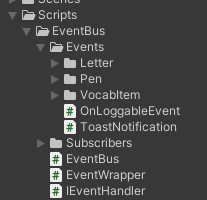

# Event Bus 



All objects can emit and listen to events via the Event Bus. For this project, the event bus is a part of the `Game` object in the hierarchy.

# Creating a new event

To add a new event:


1. Make a copy of the `Scripts/EventBus/TemplateEvent.cs` script and rename it to the event you want to add.
2. Edit the source code of the newly created file, specifically lines 7 and 12, to add any arguments (like a string to be passed, or a number) you want to send along with the event call. (see above image)
3. Edit the `Scripts/EventBus/EventBus.cs` script, adding your new event as well as the wrapper for it where the other events and wrappers are (under the TODOs).

# Invoking an event

Invoke the event via the EventBus singleton.

For example, invoking the `TemplateEvent` and passing a `GameObject` would look like so:

```cs
# ...

private GameObject randomObject;

# ...

EventBus.Instance.TemplateEvent.Invoke(randomObject);
```

# Listening to an event

Make sure your script inherits the `EventSubscriber` class, as well as the handlers of any events you want it to listen to. Also, make sure you implement the `OnEvent` function.

For example, a sample script listening to a `TemplateEvent` emit passing a `GameObject` would look like this:

```cs
# ...
public class SampleObject : EventSubscriber, TemplateEvent.IHandler {
    # Other methods and variables
    # ... 

    void TemplateEvent.IHandler.OnEvent(GameObject obj) {
        # what should this sample object do when this event is invoked?
    }
}
```