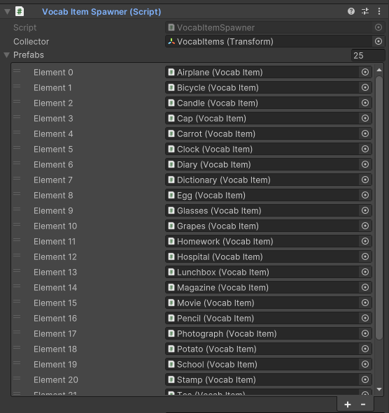

# Item Spawner

The `ItemSpawner` is also a component of the `Game` object. This manages spawning prefabs from a pre-populated JSON file.

The `Collector` is the parent of all spawned prefabs. There is also a list of `Prefabs` of vocab items. The Item Spawner will spawn items according to the `Type` field.

It is recommended to name your vocab item and its Type field the same thing (its English name), to avoid confusion.