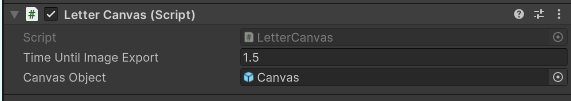

# The Canvas

The canvas is a child of the Player object in the hierarchy. It is spawned in front of the user whenever an item is in Write state.

There is a UI on top of it that is optionally enabled if the vocabulary item is reported to have character tracing on.

After the user finishes writing a letter, after a short wait (the `Time Until Image Export` field, note it is in seconds), the canvas is cleared and its contents are sent to a letter prediction API.

# The Pen

The pen is an emissive particle system located on the user's writing hand's pointer finger. The grip button of the dominant hand's controller is used to "turn on" the ink.

Note that the ink will only show on the canvas.