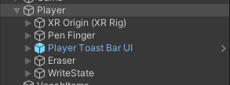
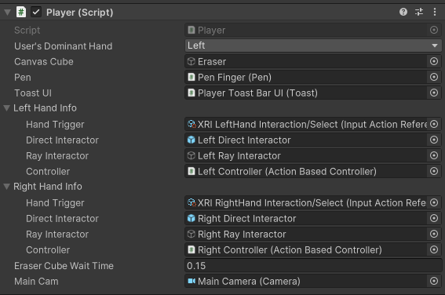

# The Player

The player/user has several objects attached to them:
- XR Origin: allows the player to move and interact with items in VR
- Pen Finger: allows the player to write on the canvas with their pointer finger (as long as the grip button is held down)
- Toast Bar UI: a notification that shows the player whether their guess of the Vocab Item's spelling is correct or not
- Eraser: The Canvas Eraser Cube tool
- WriteState: contains the tracing UI and canvas

# Setup

Select the user's dominant hand. On pressing the Play button, all item interaction will be delegated to the dominant hand, and movement will be delegated to the non-dominant hand.

Also, in the `Game` object, set the User ID to the user's ID, whatever it may be.