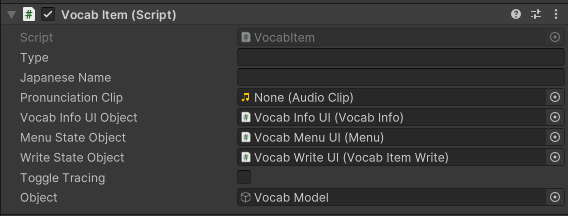
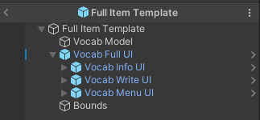
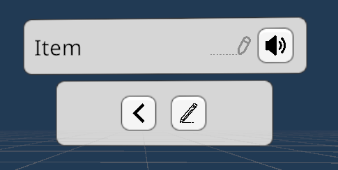
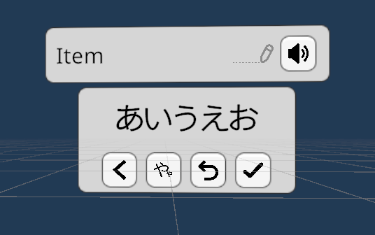

# Vocab Item

## Vocab Item Scripts

The `Assets/Scripts/VocabItem` directory looks like this:

```
    VocabItem.cs
    VocabItemBounds.cs
    VocabItemStates.cs
    VocabItemWrite.cs
```

### VocabItem 



This should go in the root object (see `Assets/Prefabs/Template/Full Item Template`). 

- Type: The English name of the vocab item. (This cannot be changed without changing the object the VocabItem inherits from.)
- Japanese Name: The Japanese name of the vocab item. In Hiragana only.
- Pronunciation Clip: Stored in `Assets/AudioFiles`. The Japanese pronunciation of the item.
- Vocab Info UI Object/Menu State Object/Write State Object: The UI objects representing the vocabulary's English name and Japanese pronunciation, the menu state, and the writing state.

### VocabItemBounds

The script the Vocab Item Bounds object (see the Full Item Template) uses to signal to the Vocab Item that the model is away from where the UI popped up, and to switch to Idle UI state.

### VocabItemStates

A vocab item has three UI states:

- Idle: no UI shows up
- Menu: The UI for vocabulary info, as well as a menu with two buttons to either go back or attempt to write the word shows up
- Writing: The UI for vocabulary info, as well as UI to show what the user has written and to undo/submit guesses, shows up

The item also has two "learning" states:

- Not Learned: the user hasn't written the word correctly yet
- Learned: the user has written the word correctly at least once

### VocabItemWrite

The script that manages the Writing state of the vocabulary item. It handles all the logic for adding/removing/changing a character, showing the player's guess, as well as submitting the player's guess.

## Vocab UI Scripts

The `Assets/Scripts/VocabUI` directory looks like this:

```
    Hint.cs
    Menu.cs
    Toast.cs
    Tracing.cs
    UIFacePlayer.cs
    VocabInfo.cs
    VocabUI.cs
    Write.cs
```

All UI inherits from the `VocabUI` object and contains methods for editing the text of a `TextMeshProUGUI` object.

- `UIFacePlayer.cs` is so that UI items can face the user regardless of what angle they're looking at the object in.
- `Hint` is for the teacher's desk in the middle of the classroom and shows the Romaji spelling of the Japanese word.
- `Menu`, `Write`, and `VocabUI` are for vocab items.
- `Tracing` is for the user to trace the Hiragana over the canvas (if the vocab item has tracing enabled).

## Prefabs

The `Assets/Prefabs` directory has these subdirectories:

```
├───Vocab Items
│   ├───Full Items [for items with UI and model included]
│   ├───Models     [just the models]
│   └───Template   [a template for future use]
├───VocabUI
└───Writing
```

### Full Vocab Items



A vocabulary item is complete if there is a model, UI for the vocabulary's states, and a sphere collider for bounds. The root should have a VocabItem component attached.

The vocab model contains an `XRGrabInteractable` object with the collider set to something that accurately represents the model (could be a mesh collider or a box collider). 

The full UI contains the UI for the Menu and Write states, as well as a general UI for the vocab item's English name.

# Vocab UI

The Vocab info, menu, and write UI prefabs are all combined into a single prefab called `Vocab Full UI`. 



- The Info UI shows the English name, whether tracing is on for the Japanese writing, and a button to hear the word's pronunciation.
- The Menu UI shows a button to go back and a button to attempt to write the word in Hiragana based on hearing its pronunciation.



- The Write UI shows the user's guess in Hiragana, as well as 4 buttons. From left to right:
    - The leftmost button takes the user back to the vocab's menu
    - The button with the big and small や is to toggle a character's small/chiisai version, if it has one
    - The third button is to undo the last written character
    - The checkmark is to submit the guess as shown above

# Creating a new vocab item

To create a new item:

1. Create a **prefab variant** of the `Full Item Template` prefab and name it after the item you want to represent.
2. With your 3D model imported in the editor, create a collider for it. This could be a box or a mesh collider, but preferably not a sphere collider.
3. Put the 3D model, with the collider, under the `Vocab Model` object. Make sure to drag the object containing the model's collider to the "Colliders" section of the XRGrabInteractable component.
4. (Optional, but recommended) Rename `Vocab Model` to the vocab item and create a prefab under the `Assets/Prefabs/Vocab Items/Models` folder.
5. With the root object selected (named after the item, from Step 1), drag and drop your pronunciation clip\* and vocab model object to the Pronunciation Clip and Object fields respectively.
6. Type in the English name in the Type field, and the Hiragana spelling in the Japanese Name field.
7. Go to the `Item Spawner` component of the `Game` object, and add your new item to the Prefabs list.
8. Edit the `vocab_items.json` to add the English name of your new object.

(The "Enable Tracing" field is randomly determined.)


\* It was a lot easier to drag and drop a voice clip in Unity than to have the built in TTS running. To create these voice clips, I used the [VoiceVOX](https://voicevox.hiroshiba.jp) program (Japanese only).